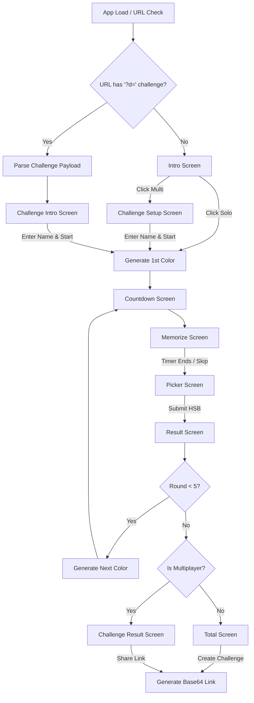

<div align="center">

</div>

# Run and deploy your AI Studio app

This contains everything you need to run your app locally.

View your app in AI Studio: https://ai.studio/apps/8d3571dd-3935-445b-8dda-db724aabaa94

## Run Locally

**Prerequisites:**  Node.js


1. Install dependencies:
   `npm install`
3. Run the app:
   `npm run dev`

# colorMemory (Color Memory Game)

## The intentions and technical requirements. 

Here are the 11 TINS framework questions paired with the exact requirements:

### 1. Project Title and Description
**Question:** What is the name of the software, and what is its overall goal and purpose?
**Answer:** The project is named "color" (also referred to as "colorMemory"). It is a color memory game that tests how well humans can recall specific colors. Users are shown a color, and after a countdown, they must recreate it using Hue, Saturation, and Brightness (HSB) sliders. It supports Solo and Multiplayer (challenge link) modes.

### 2. Core Logic and Features
**Question:** What are the main functions, computations, processes, or behaviors the application needs?
**Answer:** 
*   **Game Loop:** 5 rounds per game.
*   **Difficulty Modes:** Easy (5 seconds to memorize) and Hard (2 seconds to memorize, with screen-shake animations and distracting countdown colors).
*   **Scoring Algorithm:** Converts HSB guesses to RGB, then to the CIELAB (Lab) color space to calculate the $\Delta E$ (Delta E) visual difference. It applies custom penalties/recoveries based on hue and saturation offsets. Maximum score is 10 per round (50 total).
*   **Multiplayer/Challenges:** Generates a Base64 encoded payload containing the challenger's name, the 5 colors, the mode, and previous scores, which is passed via the URL `?d=` parameter.
*   **Audio Synthesis:** A custom Web Audio API implementation (`sound.ts`) that synthesizes game sounds (ticks, hums, robot voices, success/fail blips) without external audio files.
*   **Dynamic Copy:** Generates "sassy" contextual text descriptions based on how well or poorly the user scored.

### 3. Data Structure and Handling
**Question:** What kind of data does the application use? How is it stored, retrieved, processed, or managed?
**Answer:** State is managed globally using `zustand`. Key data structures include:
*   `round`: Integer (1-5).
*   `totalScore`: Float (0-50).
*   `currentHsb` & `pickerHsb`: Tuples `[Hue, Saturation, Brightness]` representing the target and guessed colors.
*   `roundScores`: Array of floats.
*   `challenge`: Object tracking multiplayer state `{ active: boolean, code: string, challengerName: string, colors: HSB[], mode: 'easy'|'hard', scores: Array }`.
*   **Storage:** LocalStorage is used sparingly to save the player's name/initials and mute preferences.

### 4. User Interface Requirements
**Question:** What specific windows, dialogs, layouts, or widgets are needed? How should these UI elements be arranged?
**Answer:** The UI is a centered, card-like container (max-width 476px) that mimics a mobile app experience on desktop. 
*   **Screens:** Intro (Main Menu), Challenge Setup/Result, Countdown, Memorize (timer display), Picker (3 color sliders), Result (split-screen showing Target vs. Guessed color), and Total (final score + color swatches).
*   **Widgets:** Circular action buttons, custom HSB slider strips with gradients, animated score counters (rolling numbers), and a dark/light mode toggle.
*   **Animations:** Heavy use of CSS keyframes for screen transitions, ripple effects, "earthquake" shaking (Hard mode), and elastic content bounces.

### 5. User Interaction and Event Handling
**Question:** How does the user interact with the UI? What actions should trigger specific logic?
**Answer:** 
*   Users tap/drag custom slider handles to adjust Hue, Saturation, and Brightness. The background color updates in real-time as the sliders move.
*   Users click circular "Go" buttons to advance through the game phases (Start -> Countdown -> Memorize -> Picker -> Result).
*   Users can skip the memorize timer early by clicking the action button.
*   Clicking "Share" in multiplayer generates a link, triggering the Web Share API (on mobile) or copying to the clipboard (on desktop).

### 6. Input and Output Specifications
**Question:** How does data enter and leave the system? Specify expected formats where relevant.
**Answer:** 
*   **Input:** URL Query parameters (`?d=Base64String`) load multiplayer states. User text input for player names/initials (max 12 chars for name, 3 for initials). Touch/Mouse coordinates for slider values.
*   **Output:** Base64 encoded URL generation for sharing. Dynamic visual outputs (background colors, UI text colors adapting to background luminance).

### 7. Dependencies and Third-Party Integrations
**Question:** Does the application need to use specific libraries or connect to external services/APIs?
**Answer:** 
*   **Framework:** React 19, TypeScript, Vite.
*   **Styling:** Tailwind CSS 4 (plus extensive custom CSS).
*   **State:** Zustand.
*   **Icons/Animations:** `lucide-react`, `motion`.
*   **Database (Leaderboard context):** Supabase (RPC calls for submitting scores).

### 8. Error Handling and Validation
**Question:** What potential errors should the application anticipate and handle?
**Answer:** 
*   **Profanity Filter:** A `spicy.ts` filter checks player names against a blocklist. If flagged, a `SpicyOverlay` UI prompts the user to either change the name or force-keep it.
*   **URL Decoding:** If the URL challenge payload (`?d=`) is malformed or tampered with, the app catches the error and gracefully falls back to the main Intro screen.
*   **React Errors:** A top-level `<ErrorBoundary>` catches fatal UI crashes and displays a custom "Something broke" fallback screen.

### 9. Technical Constraints and Non-Functional Requirements
**Question:** Are there specific performance goals, memory limits, or other technical considerations?
**Answer:** 
*   **Audio Context:** The Web Audio API requires a user interaction (click/touch) to unlock. The app binds unlock events to global listeners.
*   **Performance:** Slider dragging must be highly performant. State updates for the sliders must not cause UI lag, requiring efficient re-rendering.
*   **Accessibility/Legibility:** Text colors overlaid on dynamically generated background colors must automatically switch between black and white based on the calculated luminance of the background color.

### 10. Acceptance Criteria
**Question:** How will the user know if the generated code correctly implements a feature?
**Answer:** 
*   The game successfully runs through exactly 5 rounds.
*   The scoring algorithm correctly assigns higher scores to visually similar colors and lower scores to contrasting colors.
*   Copying a challenge link and pasting it into a new tab perfectly restores the opponent's score, colors, and difficulty mode.
*   Audio synthesizes correctly without external `.mp3`/`.wav` assets.

### 11. Visual Aids
**Question:** Do you have any design sketches, diagrams, or example data structures you can describe or share?
**Answer:** 
*   **Layout Constraint:** The app functions as a full-screen mobile app, but on desktop, it acts as a floating centered card (`width: 476px`, `box-shadow`).
*   **Slider Design:** Three vertical strips. Hue is a full rainbow gradient. Saturation is a gradient from the current hue to gray/white. Brightness is a gradient from the current hue/saturation to black.
*   **Color Swatches:** Final result screens display a row of square cards split diagonally: the top-left triangle shows the target color, the bottom-right shows the player's guessed color.

---

# colorMemory

<!-- ZS:COMPLEXITY:HIGH -->
<!-- ZS:PRIORITY:HIGH -->
<!-- ZS:PLATFORM:WEB -->
<!-- ZS:LANGUAGE:TYPESCRIPT -->
<!-- ZS:FRAMEWORK:REACT -->

## Description

**colorMemory** is a highly polished, interactive web-based game that tests a user's ability to memorize and recreate colors. The application challenges players to look at a randomly generated color for a few seconds, and then accurately recreate it using Hue, Saturation, and Brightness (HSB) sliders. 

The game supports both Solo play and asynchronous Multiplayer (via shareable challenge links). It features complex scoring algorithms based on CIELAB human visual perception, fully synthesized Web Audio (no external sound files), and a mobile-first UI that acts as a floating card on desktop devices.

---

## Application Flow



---

## Functionality

### Core Features
1. **5-Round Game Loop**: Each game consists of 5 rounds. Max score per round is 10.00 (Max total: 50.00).
2. **Color Representation**: All internal state uses the HSB (Hue, Saturation, Brightness) color model to populate UI components, but converts to RGB and CIELAB for accurate scoring.
3. **Difficulty Modes**:
   - **Easy Mode**: 5 seconds to memorize the color.
   - **Hard Mode**: 2 seconds to memorize. The UI shakes violently, and the "Ready, Set, Go" countdown flashes distracting, high-contrast random colors.
4. **Asynchronous Multiplayer**: Players can generate a Base64-encoded URL containing their score, the 5 exact target colors, and their guesses to challenge friends.
5. **Synthesized Audio**: 100% of the game's sound effects (ticks, hums, countdown blips, error noises, and a robotic text-to-speech announcer) are generated procedurally using the native Web Audio API and Speech Synthesis API.
6. **Sassy Feedback System**: Generates dynamic, highly sarcastic text descriptions of the player's performance based on their score bracket (e.g., "A blindfolded toddler smashing the screen would have outperformed you").

### User Interface & Screens

The application restricts its main view to a centralized container (acting as a mobile viewport). The screens transition using opacity and transform animations.

1. **Intro Screen (`/intro`)**:
   - Title: "color"
   - Subtitle explaining the game.
   - Two main buttons: "Single Player" (icon) and "Multiplayer" (icon). 
   - A toggle switch for Easy/Hard mode.
   - A mute toggle (bottom right).
2. **Challenge Setup Screen (`/challenge-setup`)**:
   - Prompt explaining multiplayer.
   - Text input for the player's name (Max 12 chars). Features a custom animated cursor tracking text width.
   - "Start playing" button.
3. **Challenge Intro Screen (`/challenge-intro`)**:
   - Displayed when a user opens a challenge link.
   - Shows "[Challenger Name] challenged you to a game."
   - Text input for the user's name.
4. **Countdown Screen (`/countdown`)**:
   - Flashes "ready", "set", "go". 
   - Easy mode: Background transitions to the target color on "go".
   - Hard mode: Background flashes high-contrast distracting colors.
5. **Memorize Screen (`/memorize`)**:
   - Full-screen background of the target color.
   - Large timer counting down seconds and hundredths.
   - A "Skip" button to bypass the timer.
6. **Picker Screen (`/picker`)**:
   - Background starts at a randomized HSB value (seeded differently from the target).
   - Three vertical slider strips: 
     - **Hue**: Full rainbow gradient.
     - **Saturation**: Gradient from full saturation (current hue/brightness) to white/gray.
     - **Brightness**: Gradient from full brightness (current hue/saturation) to black.
   - Dragging the sliders instantly updates the background.
   - "Submit color" button.
7. **Result Screen (`/result`)**:
   - Split horizontally: Top half shows the guessed color, bottom half shows the target color.
   - A large rolling number animation climbing from 0 to the calculated round score (e.g., 8.42).
   - A sarcastic feedback string based on the round score.
   - "Next round" button.
8. **Total Screen (`/total`)**:
   - Shows the final score (e.g., 42.50 / 50).
   - A row of 5 diagonal split-swatches (top-left: target, bottom-right: guess) with individual round scores.
   - Input for 3-letter initials.
   - Button to "Post score & challenge a friend" (copies URL to clipboard).
9. **Challenge Result Screen (`/challenge-result`)**:
   - Leaderboard view comparing the player's score to the challenger(s).
   - Ranks players, shows their total scores, and renders the comparison split-swatches side-by-side.

### Behavior Specifications
- **Text Readability**: Any text overlaid on a dynamic background color must calculate the background's luminance `(0.299*R + 0.587*G + 0.114*B) / 255`. If luminance > 0.45, text is `#000` (black); otherwise, text is `#fff` (white).
- **Profanity Filter**: When a user submits a name, it is checked against a predefined `spicy.ts` list of mild/hard profanities. If triggered, a `SpicyOverlay` modal asks the user: "Change it" or "Keep it".

---

## Technical Implementation

### Architecture
- **Framework**: React 19 via Vite.
- **State Management**: Zustand for global game state.
- **Styling**: Tailwind CSS v4 coupled with heavy custom CSS for complex animations (keyframes, spring bounces, SVG SVG filters for blur/shake).
- **Audio**: Custom singleton `SFX` module utilizing `AudioContext`.

### Data Models

**Zustand Global Store (`useGameStore`)**:
```typescript
interface GameState {
  currentScreen: ScreenType;
  round: number;
  totalScore: number;
  currentHsb: [number, number, number]; // Target color
  pickerHsb: [number, number, number];  // User's current slider state
  roundScores: number[];
  playerColors: [number, number, number][];
  challengeColors: [number, number, number][];
  hardMode: boolean;
  challenge: {
    active: boolean;
    code: string | null;
    challengerName: string;
    colors: [number, number, number][];
    mode: 'easy' | 'hard';
    scores: Array<{name: string, score: number, round_scores: number[], player_colors: [number, number, number][]}>;
  };
}
```

**Multiplayer URL Payload (Base64 JSON in `?d=` param)**:
```json
{
  "n": "ChallengerName",
  "c": [[120, 50, 80], [340, 90, 90], ...], // 5 target HSB colors
  "m": "easy", // or "hard"
  "s": 42.5, // Total score
  "rs": [8.5, 9.0, 7.5, 8.5, 9.0], // Round scores
  "pc": [[118, 52, 78], ...] // Player's submitted HSB colors
}
```

### Algorithms

**1. Scoring Algorithm (`scoreHsb`)**:
The LLM must implement the scoring logic precisely as follows:
1. Convert Target HSB and Guessed HSB to RGB.
2. Convert both RGB values to the CIELAB (`Lab`) color space.
3. Calculate Delta E ($\Delta E$) using the Euclidean distance between the two Lab values: `sqrt((L1-L2)^2 + (a1-a2)^2 + (b1-b2)^2)`.
4. Calculate Base Score: `10 / (1 + (dE / 32)^1.6)`.
5. Calculate Hue Difference: `min(abs(h1 - h2), 360 - abs(h1 - h2))`.
6. Calculate Average Saturation: `(s1 + s2) / 2`.
7. **Recovery Bonus**:
   - `hueAcc = max(0, 1 - (hueDiff / 25)^1.5)`
   - `satWeightR = min(1, avgSat / 30)`
   - `recovery = (10 - baseScore) * hueAcc * satWeightR * 0.30`
8. **Penalty Deduction**:
   - `huePenFactor = max(0, (hueDiff - 40) / 140)`
   - `satWeightP = min(1, avgSat / 40)`
   - `penalty = baseScore * huePenFactor * satWeightP * 0.3`
9. **Final Score**: `Base + Recovery - Penalty`. (Add a tiny random jitter `[-0.04, 0.04]` if the score is under 9.8, clamp between 0 and 10, round to 2 decimal places).

**2. Number Rolling Animation**:
When revealing scores, use a `requestAnimationFrame` loop with a quintic ease-out function (`1 - (1 - t)^5`) to interpolate from 0 to the target score. The integer part and decimal part (`.00`) should be in separate DOM spans to allow CSS class toggling for vertical slide-in animations on every digit change.

### Procedural Audio (Web Audio API)
The `sound.ts` module must instantiate a global `AudioContext` (unlocked via standard DOM interaction events). Implement functions for:
- `hover()`: Sine wave, 880Hz, 0.06s.
- `click()`: Triangle wave 640Hz -> Sine 960Hz.
- `tick()`: Square wave, 1200Hz, 0.025s (Used for slider dragging and score rolling).
- `hardOn()`: Complex sawtooth wave with a `WaveShaperNode` distortion curve, high-pass filtered noise, and a sine kick drop to simulate a "hardcore system activation" sound.
- `scoreLand()`: Three layered sine waves (1046Hz, 1318Hz, 1568Hz) playing a harmonious chord when the score animation finishes.

---

## Input/Output

- **URL Handling**: On initialization, the app must parse `window.location.search`. If `?d=` is present, decode from Base64 to JSON, validate the schema, and populate the `challenge` state. 
- **Share Link Generation**: Serialize the current player's stats into the JSON schema, convert to Base64 via `btoa()`, and append to `window.location.origin + window.location.pathname + '?d='`. Use `navigator.clipboard.writeText` to copy.
- **Sliders**: The custom HSB sliders must listen to `mousedown`/`touchstart` and attach `mousemove`/`touchmove` to the `document` to calculate the Y-axis percentage relative to the DOM element's `getBoundingClientRect().height`.

---

## Error Handling

1. **React Boundary**: Implement a top-level `<ErrorBoundary>` class component. If any React render fails, display a `#000` full-screen fallback with the text "Something broke." and a "Try again" reload button.
2. **Malformed Challenge URLs**: Wrap the Base64 decoding (`atob` and `JSON.parse`) in a `try/catch`. If parsing fails or data is missing the `c` (colors) array, gracefully reset the state and route the user to the `intro` screen.
3. **Audio Context Failures**: Wrap all audio oscillator invocations in `try/catch` blocks. If the browser restricts audio or the context is suspended, the visual game must continue functioning normally without crashing.

---

## Style Guide & Layout Constraints

- **Container Constraint**: On desktop (`min-width: 768px`), the `<body>` is centered with `display: flex`. The actual `#game-container` is strictly `width: 476px`, `max-height: 78vh`, with a `border-radius: 16px` and a heavy drop shadow. On mobile, it is `width: 100vw; height: 100vh`.
- **Typography**: The primary font stack is `Suisse Intl S Alt, -apple-system, Inter, system-ui, sans-serif`. Heavy use of tight letter spacing (e.g., `-5.52px` for large headers).
- **Dark Mode**: Desktop users have a sun/moon toggle. Clicking it transitions the HTML/Body `background-color` between `#fff8e1` (light) and `#000` or `#2f2f2f` (dark). The `#game-container` background is always `#000` regardless.
- **Visual Feedback**: Buttons should have a `transform: scale(1.02)` on hover and `scale(0.97)` on active/click.

---

## Acceptance Criteria

1. **Scoring Accuracy**: The math for converting HSB -> RGB -> LAB and resulting in Delta E matches standard colorimetric formulas. Identical colors score exactly 10.00.
2. **Multiplayer State Preservation**: Generating a link, opening it in an incognito window, completing 5 rounds, and viewing the Result screen perfectly displays both players' names, identical target colors, and accurate score comparisons.
3. **Performance**: Dragging the HSB sliders at high speed securely updates the background color without dropping frames, dropping below 60FPS, or causing maximum call stack errors.
4. **Resilience**: Modifying the URL `?d=` parameter to invalid base64 does not crash the app, but safely returns the user to the main menu.